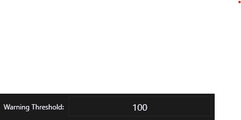
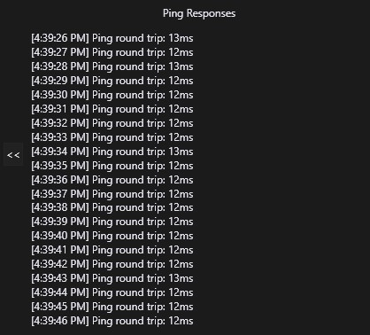
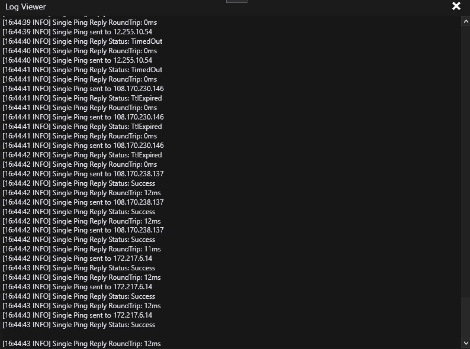
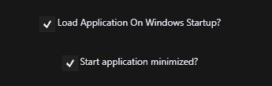
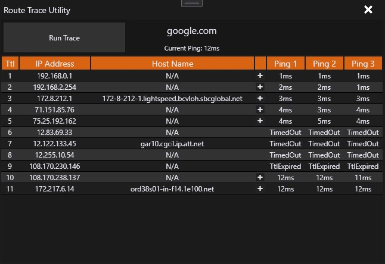

# PingLogger #
### Version 2 is GUI only. ###
Download the latest release from [Here](https://github.com/vouksh/PingLogger/releases/latest)

## Features ##
* Offers 2 distribution methods
  * Single-file that can be placed anywhere and ran. Tradeoffs are file size and more manual clean up if you want to remove it.
  * Installer that defaults to C:\PingLogger. Smaller download, and allows for easy removal.
* Allows for many simultaneous hosts to be logged at one time.
  * Only limit is your network capabilities.
  * Verifies that the host exists before starting. 
* Extremely flexibile
  * Change your timeout, packet size, ping interval, or warning threshold. 
  * Great for power users. 
* Can start on demand, or with windows logon. 
* Interface adapts to users dark/light mode prefences in Windows.

## Help!! ##
#### Unsure of what something does? ####
* 
  * This is where you input the name or IP address of the remote host that you want to ping. 
  * This includes local area network hosts.
* 
  * You can't edit this field. It is populated by the program with the IP address of what is input above. 
  * In this example, 172.217.6.14 is the IP address for google.com.
* 
  * This is where you specify how long (in milliseconds) to wait inbetween pings. **This is regardless of Timeout!**
  * If your timeout is longer than your interval, the responses can appear out of order!
* 
  * This is where you specify the response time at which you consider it to be a little too long, but not long enough to be a timeout.
  * This can help you find network slowdowns. So if something is supposed to respond in 10-15ms, but you're getting over 100ms, then it's considered a warning, and is marked as such in the logs. 
* 
  * This is where you specify how long you want to wait before considering a ping to be dropped, or timed out. 
  * *Caveat: If you set this less than ~500ms, the application will still recieve the ping back, but it will still be marked timed out!
* 
  * *This should only be changed if you know what you're doing*
  * You can specify the size of the ICMP packet that gets sent. 
  * This has a hard cap of 64kb. This is a limitation of the protocol, not the application. 
  * If you increase this, your packet can and WILL be fragmented, and this will be noted in the logs as a warning. 
* 
  * Click this to expand the Ping Response Box which gives a trimmed down view of the logs as the pinger is running.
  * Click it again to collapse it back down. This state is saved between application start and stop.
  * 
* 
  * Clicking this will open a new window that will allow you to watch the full log file in real time for that host. 
  * Button will only show if a log exists for that host and the current day.
  * 
* 
  * This opens the logs folder for the current host.
  * For example, if the PingLogger is under C:\PingLogger and the host was google.com, it would open a file explorer to C:\PingLogger\Logs\google.com\
* 
  * This simply sets the warnings, timeouts, total number of pings, and average ping counters all back to 0, in case you make a change to one of the options and want to get a fresh reading. 

## Options ## 
* 
  * On by default, if this is checked, the program will GitHub for the latest version and download it
  * If you used the installer, it will download the newest installer and run it silently. 
  * If you chose to go with the single file, it will rename the current exe download the newest single-file executable.
  * Both options will clean up any downloaded/renamed files afterwards
* 
  * If this is checked, all hosts will start as the program loads up, so you don't have to do it manually.
* 
  * If you check this, it will create a shortcut in the Start Up folder of the start menu that causes it to load on Windows login. 
* 
  * This option, which is only visable & applicable when the above Load With Windows option is checked, will cause the application to start in a minimized state.
* 
  * The rolling number of days to keep log files. Defaults to 7 days.
* 
  * 3 options: Auto, Dark, and Light.
  * Auto will pick a theme based on your Windows settings.
* 
  * Use these buttons to start or stop all of the loggers at the same time. 

## Trace Route ##
There is a built-in trace route utility that will help you diagnose issues with timeouts and high latency.
It's similar to the TRACERT command in Windows [Click here to find out more info about TRACERT](https://support.microsoft.com/en-us/help/314868/how-to-use-tracert-to-troubleshoot-tcp-ip-problems-in-windows)
* Access it by clicking the Run Trace Route button 
* In the new window, click Run Trace to see the hops that are being taken to reach the destination.
  * 
* It will do a quick normal ping, then start tracing through the hops. 

## Running Requirements ##
Only requires a 64-bit Windows 7 or 10 Operating System.
Application is fully self-contained and does not require .NET Core 3.1 to be installed prior. 

## Developer Requirements ##
* Visual Studio 2019 or newer (VS Code may work - not tested!)
* .NET Core 3.1 SDK

